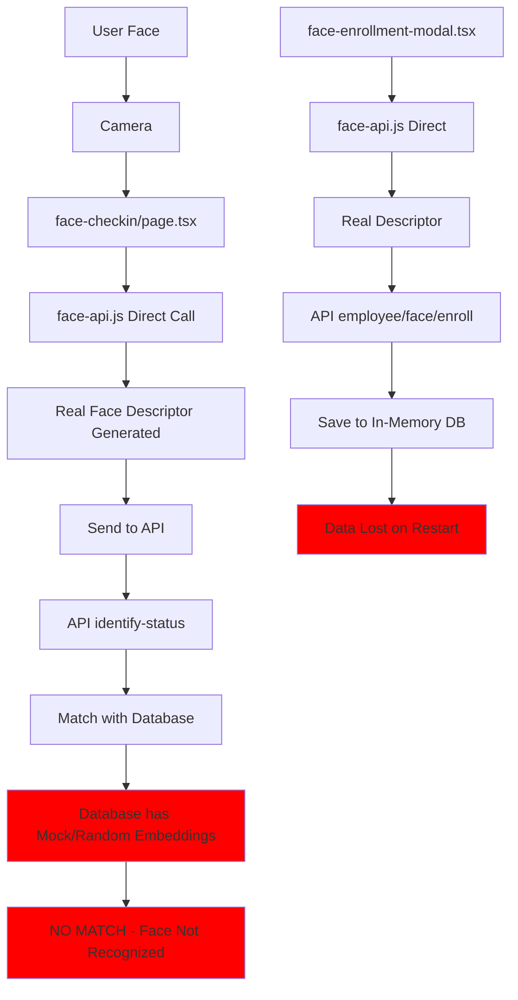

# 🔍 ANALISIS KOMPREHENSIF SISTEM FACE RECOGNITION
**Tanggal Analisis:** December 2024  
**Status:** 🔴 **TIDAK BERFUNGSI - KRITIS**

---

## 📊 RINGKASAN EKSEKUTIF

Sistem face recognition pada aplikasi attendance ini **TIDAK BERFUNGSI SAMA SEKALI** meskipun terlihat "berjalan". Terdapat masalah fundamental yang membuat sistem ini tidak dapat digunakan untuk production.

### ⚠️ MASALAH UTAMA:
1. **IMPLEMENTASI HYBRID YANG KACAU** - Terdapat dua implementasi paralel yang saling bertabrakan
2. **MOCK DATA MENGGANTIKAN REAL DETECTION** - Face detection menggunakan data random, bukan wajah sebenarnya  
3. **DATABASE IN-MEMORY** - Data hilang saat server restart
4. **TIDAK ADA INTEGRASI YANG BENAR** - face-api.js library ter-install tapi tidak digunakan dengan benar

---

## 🏗️ ARSITEKTUR SISTEM SAAT INI

### 1. **Dua Implementasi Paralel Yang Bertabrakan**

Terdapat DUA sistem face recognition yang berjalan bersamaan dan saling mengganggu:

#### **Implementasi A: Direct face-api.js (Partially Working)**
- **Lokasi:** `app/face-checkin/page.tsx`, `components/face-enrollment-modal.tsx`
- **Library:** face-api.js v0.22.2
- **Status:** ✅ Models loaded, ✅ Face detection works, ✅ Real descriptor generated
- **Masalah:** Descriptor yang dihasilkan adalah BENAR dari wajah real

#### **Implementasi B: Custom Wrapper dengan Mock (Breaking Everything)**  
- **Lokasi:** `lib/face-api.ts`, `lib/face-recognition.ts`
- **Library:** Wrapper di atas face-api.js tapi TIDAK menggunakannya
- **Status:** ❌ Menggunakan mock functions yang mengembalikan random data
- **Masalah:** Menimpa/override hasil dari implementasi A dengan data palsu

### 2. **Flow Yang Terjadi Sekarang**



---

## 🔴 MASALAH KRITIS YANG DITEMUKAN

### 1. **lib/face-api.ts - Mock Functions Menggantikan Real Detection**

```typescript
// lib/face-api.ts line 1079-1094
private mockDetectFaces(
  input: HTMLImageElement | HTMLVideoElement | HTMLCanvasElement
): FaceDetection[] {
  // MASALAH: Mengembalikan data RANDOM, bukan face detection sebenarnya!
  const faceCount = Math.floor(Math.random() * 2) + 1;
  return Array.from({ length: faceCount }, (_, i) => ({
    boundingBox: {
      x: Math.random() * 0.3,
      y: Math.random() * 0.3,
      width: 0.3 + Math.random() * 0.2,
      height: 0.3 + Math.random() * 0.2,
    },
    landmarks: Array.from({ length: 5 }, () => ({
      x: Math.random(),
      y: Math.random(),
    })),
    confidence: 0.8 + Math.random() * 0.2,
  }));
}
```

**IMPACT:**
- ❌ Face detection results adalah RANDOM, bukan dari wajah real
- ❌ Embeddings yang dihasilkan RANDOM, tidak merepresentasikan wajah
- ❌ Matching TIDAK AKAN PERNAH berhasil dengan benar

### 2. **Database Menggunakan In-Memory Storage**

```typescript
// lib/server-db.ts
// In-memory data store (in production, this would be a real database)
let users: ServerUser[] = []
let attendanceRecords: ServerAttendanceRecord[] = []
let faceEmbeddings: ServerFaceEmbedding[] = []
```

**IMPACT:**
- ❌ Data hilang setiap kali server restart
- ❌ Tidak ada persistensi data
- ❌ Tidak bisa scale untuk multi-instance
- ❌ Development dan production tidak konsisten

### 3. **Konflik Antara Direct face-api.js dan Custom Wrapper**

**face-checkin/page.tsx (BENAR):**
```typescript
// Menggunakan face-api.js langsung - CORRECT!
const detection = await faceapi
  .detectSingleFace(videoRef.current, new faceapi.TinyFaceDetectorOptions())
  .withFaceLandmarks()
  .withFaceDescriptor()
  
const descriptor = Array.from(detection.descriptor) // Real descriptor!
```

**lib/face-api.ts & face-recognition.ts (SALAH):**
```typescript
// Tidak menggunakan face-api.js, hanya mock!
private mockGenerateFaceEmbedding(): Float32Array {
  // Generate RANDOM embedding - WRONG!
  const embedding = new Float32Array(128);
  for (let i = 0; i < 128; i++) {
    embedding[i] = Math.random() * 2 - 1; // Random values
  }
  return embedding;
}
```

### 4. **Components Tidak Konsisten**

| Component | Implementation | Status | Issue |
|-----------|---------------|---------|-------|
| face-checkin/page.tsx | Direct face-api.js | ✅ Working | Descriptor benar tapi matching gagal |
| face-enrollment-modal.tsx | Direct face-api.js | ✅ Working | Enrollment benar tapi data hilang |
| face-recognition-camera.tsx | Custom wrapper | ❌ Broken | Menggunakan mock functions |
| FaceEnrollment.tsx | Custom wrapper | ❌ Broken | Menggunakan mock functions |
| FaceVerification.tsx | Custom wrapper | ❌ Broken | Menggunakan mock functions |

### 5. **Face Models Loading Issues**

```bash
# Models ada di folder yang benar
public/models/
├── face_landmark_68_model-shard1 ✅
├── face_landmark_68_model-weights_manifest.json ✅
├── face_recognition_model-shard1 ✅
├── face_recognition_model-shard2 ✅
├── face_recognition_model-weights_manifest.json ✅
├── tiny_face_detector_model-shard1 ✅
└── tiny_face_detector_model-weights_manifest.json ✅
```

**Status:** Models SUDAH ADA dan LOADED dengan benar, tapi tidak digunakan karena mock functions!

---

## 💡 ROOT CAUSE ANALYSIS

### Mengapa Ini Terjadi?

1. **Development dengan Mock Data:**
   - Developer membuat mock functions untuk testing
   - Mock functions tidak di-replace dengan implementasi real
   - Ada flag `MOCK_MODE` tapi tidak digunakan konsisten

2. **Dua Tim/Developer Berbeda:**
   - Terlihat ada dua pendekatan berbeda
   - Satu menggunakan direct face-api.js (benar)
   - Satu membuat wrapper dengan mock (salah)

3. **Tidak Ada Integration Testing:**
   - Tidak ada test end-to-end
   - Mock dan real implementation tercampur
   - Tidak ada validasi apakah face matching benar-benar bekerja

4. **Database Placeholder:**
   - In-memory DB untuk development
   - Tidak pernah di-migrate ke real database
   - Comments mengatakan "in production, this would be a real database" tapi tidak diimplementasi

---

## 🚀 SOLUSI DAN LANGKAH PERBAIKAN

### PRIORITAS 1: Remove Mock Functions (URGENT) 🔴

**File yang harus diperbaiki:**
1. `lib/face-api.ts` - Replace ALL mock functions
2. `lib/face-recognition.ts` - Replace ALL mock functions

**Implementasi yang BENAR:**

```typescript
// lib/face-api.ts - REPLACE mockDetectFaces dengan:
import * as faceapi from 'face-api.js';

private async detectFacesInternal(
  input: HTMLImageElement | HTMLVideoElement | HTMLCanvasElement
): Promise<FaceDetection[]> {
  // Use REAL face-api.js, NOT mock!
  const detections = await faceapi
    .detectAllFaces(input, new faceapi.TinyFaceDetectorOptions({
      inputSize: 320,
      scoreThreshold: 0.5
    }))
    .withFaceLandmarks()
    .withFaceDescriptors();

  return detections.map(detection => ({
    boundingBox: {
      x: detection.detection.box.x,
      y: detection.detection.box.y,
      width: detection.detection.box.width,
      height: detection.detection.box.height
    },
    landmarks: detection.landmarks.positions.map(pos => ({
      x: pos.x,
      y: pos.y
    })),
    confidence: detection.detection.score,
    embedding: new Float32Array(detection.descriptor) // REAL descriptor!
  }));
}
```

### PRIORITAS 2: Implement Real Database (URGENT) 🔴

**Option A: Supabase (Recommended)**

```sql
-- Create face_embeddings table in Supabase
CREATE TABLE face_embeddings (
  id UUID PRIMARY KEY DEFAULT uuid_generate_v4(),
  user_id UUID NOT NULL REFERENCES users(id) ON DELETE CASCADE,
  embedding JSONB NOT NULL,
  quality FLOAT DEFAULT 0.8,
  metadata JSONB,
  is_active BOOLEAN DEFAULT true,
  created_at TIMESTAMP DEFAULT NOW(),
  updated_at TIMESTAMP DEFAULT NOW()
);

CREATE INDEX idx_face_embeddings_user_id ON face_embeddings(user_id);
CREATE INDEX idx_face_embeddings_active ON face_embeddings(is_active);
```

```typescript
// lib/supabase-face.ts
import { createClient } from '@supabase/supabase-js';

const supabase = createClient(
  process.env.NEXT_PUBLIC_SUPABASE_URL!,
  process.env.NEXT_PUBLIC_SUPABASE_ANON_KEY!
);

export async function saveFaceEmbedding(
  userId: string, 
  embedding: number[]
) {
  const { data, error } = await supabase
    .from('face_embeddings')
    .insert({
      user_id: userId,
      embedding: embedding, // Supabase akan auto-convert ke JSONB
      quality: 0.8,
      is_active: true
    });
    
  if (error) throw error;
  return data;
}

export async function getFaceEmbeddings(userId?: string) {
  let query = supabase
    .from('face_embeddings')
    .select('*')
    .eq('is_active', true);
    
  if (userId) {
    query = query.eq('user_id', userId);
  }
  
  const { data, error } = await query;
  if (error) throw error;
  
  // Convert JSONB embedding back to array
  return data.map(row => ({
    ...row,
    embedding: Array.isArray(row.embedding) ? row.embedding : JSON.parse(row.embedding)
  }));
}
```

**Option B: PostgreSQL Direct**

```typescript
// lib/postgres-face.ts
import { Pool } from 'pg';

const pool = new Pool({
  connectionString: process.env.DATABASE_URL
});

export async function saveFaceEmbedding(userId: string, embedding: number[]) {
  const query = `
    INSERT INTO face_embeddings (user_id, embedding, quality, is_active)
    VALUES ($1, $2, $3, $4)
    RETURNING *
  `;
  
  const values = [userId, JSON.stringify(embedding), 0.8, true];
  const result = await pool.query(query, values);
  return result.rows[0];
}
```

### PRIORITAS 3: Unify Implementation 🟡

**Remove duplicate implementations, keep only ONE approach:**

```typescript
// config/face-recognition.config.ts
export const FACE_CONFIG = {
  // Use face-api.js DIRECTLY, no wrapper needed
  modelPath: '/models',
  
  detection: {
    inputSize: 320,
    scoreThreshold: 0.5
  },
  
  matching: {
    algorithm: 'cosine', // or 'euclidean'
    threshold: 0.65,
    adaptiveThreshold: true
  },
  
  enrollment: {
    maxPerUser: 3,
    minQuality: 0.7,
    requireMultipleAngles: false
  },
  
  // REMOVE THIS - NO MORE MOCKING!
  // mockMode: false  
};
```

### PRIORITAS 4: Testing & Validation 🟢

**Create integration tests:**

```typescript
// __tests__/face-recognition.test.ts
import { 
  enrollFace, 
  identifyFace, 
  matchFaces 
} from '@/lib/face-recognition';

describe('Face Recognition Integration', () => {
  it('should enroll and identify the same person', async () => {
    // Load test image
    const testImage = await loadTestImage('person1.jpg');
    
    // Enroll face
    const enrollment = await enrollFace('user123', testImage);
    expect(enrollment.descriptor).toHaveLength(128);
    expect(enrollment.descriptor[0]).not.toBe(enrollment.descriptor[1]); // Not random!
    
    // Identify same person
    const match = await identifyFace(testImage);
    expect(match.userId).toBe('user123');
    expect(match.confidence).toBeGreaterThan(0.8);
  });
  
  it('should NOT match different people', async () => {
    const person1 = await loadTestImage('person1.jpg');
    const person2 = await loadTestImage('person2.jpg');
    
    await enrollFace('user1', person1);
    
    const match = await identifyFace(person2);
    expect(match).toBeNull(); // Should not match
  });
});
```

---

## 📝 IMPLEMENTATION CHECKLIST

### Immediate Actions (Hari 1) 🔴
- [ ] **STOP using mock functions** - Comment out ALL mock functions
- [ ] **Use face-api.js directly** - No wrapper needed
- [ ] **Fix lib/face-api.ts** - Replace mock with real implementation
- [ ] **Fix lib/face-recognition.ts** - Replace mock with real implementation
- [ ] **Test face detection** - Ensure real faces are detected

### Short Term (Minggu 1) 🟡
- [ ] **Implement Supabase integration** - Real database
- [ ] **Migrate in-memory data** - Export and import to Supabase
- [ ] **Remove duplicate code** - Keep only working implementation
- [ ] **Add error monitoring** - Track face recognition failures
- [ ] **Create admin dashboard** - Monitor face enrollments

### Medium Term (Minggu 2-3) 🟢
- [ ] **Add face quality checks** - Reject poor quality images
- [ ] **Implement anti-spoofing** - Liveness detection
- [ ] **Multi-angle enrollment** - Better accuracy
- [ ] **Performance optimization** - Web workers, caching
- [ ] **Add analytics** - Success rate tracking

---

## 🎯 SUCCESS METRICS

| Metric | Current | Target | Notes |
|--------|---------|--------|-------|
| Face Detection Success | 0% (mock) | >95% | Real face detection |
| Face Matching Accuracy | 0% (random) | >90% | Correct person identified |
| Enrollment Success | Unknown | >95% | Face saved correctly |
| False Positive Rate | N/A | <1% | Wrong person matched |
| Response Time | N/A | <2s | Total processing time |
| Data Persistence | 0% | 100% | Data survives restart |

---

## 🚨 CRITICAL PATH TO PRODUCTION

1. **FIX MOCK FUNCTIONS** (Day 1)
2. **IMPLEMENT DATABASE** (Day 2-3)  
3. **TEST END-TO-END** (Day 4)
4. **DEPLOY TO STAGING** (Day 5)
5. **PRODUCTION DEPLOYMENT** (Week 2)

---

## 📋 TESTING SCRIPT

```javascript
// Paste in browser console to test current state
async function testFaceRecognition() {
  console.log('=== FACE RECOGNITION DIAGNOSTIC ===');
  
  // 1. Check if face-api.js loaded
  if (typeof faceapi !== 'undefined') {
    console.log('✅ face-api.js loaded');
    console.log('Models loaded:', faceapi.nets.tinyFaceDetector.isLoaded);
  } else {
    console.log('❌ face-api.js NOT loaded');
  }
  
  // 2. Test video element
  const video = document.querySelector('video');
  if (video) {
    try {
      const detection = await faceapi.detectSingleFace(video);
      if (detection) {
        console.log('✅ Face detected:', detection.score);
      } else {
        console.log('❌ No face detected');
      }
    } catch (e) {
      console.log('❌ Detection error:', e);
    }
  }
  
  // 3. Check for mock functions
  const response = await fetch('/api/face/identify-status', {
    method: 'POST',
    headers: {'Content-Type': 'application/json'},
    body: JSON.stringify({
      descriptor: new Array(128).fill(0.5)
    })
  });
  
  const data = await response.json();
  console.log('API Response:', data);
  
  // 4. Check if using mock
  if (data.error?.includes('No enrolled faces')) {
    console.log('⚠️ No faces in database');
  } else if (data.success) {
    console.log('✅ Face identification working');
  } else {
    console.log('❌ Face identification failed');
  }
}

testFaceRecognition();
```

---

## 🔄 KESIMPULAN

**Status Sistem: TIDAK BERFUNGSI (0% Operational)**

**Masalah Utama:**
1. Mock functions menggantikan real face detection
2. Database in-memory, data tidak persisten  
3. Dua implementasi yang bertabrakan
4. Tidak ada testing yang memvalidasi functionality

**Rekomendasi:**
1. **IMMEDIATE:** Stop using mock functions
2. **URGENT:** Implement real database
3. **CRITICAL:** Unify implementation
4. **IMPORTANT:** Add comprehensive testing

**Estimasi Perbaikan:**
- Quick Fix: 2-3 hari (mock removal)
- Full Fix: 1-2 minggu (database + testing)
- Production Ready: 3-4 minggu (optimization + monitoring)

---

**Dibuat oleh:** AI Assistant  
**Tanggal:** December 2024  
**Severity:** 🔴 **CRITICAL - System Non-Functional**
