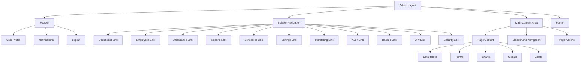
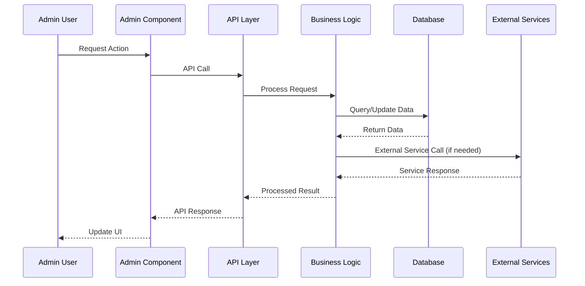
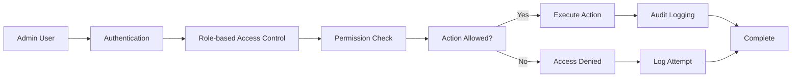
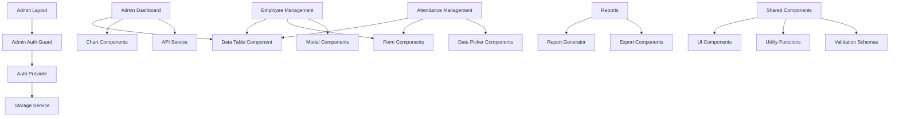
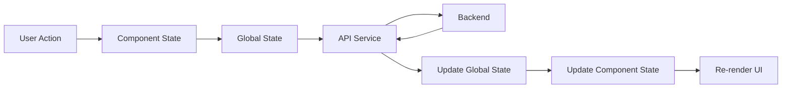
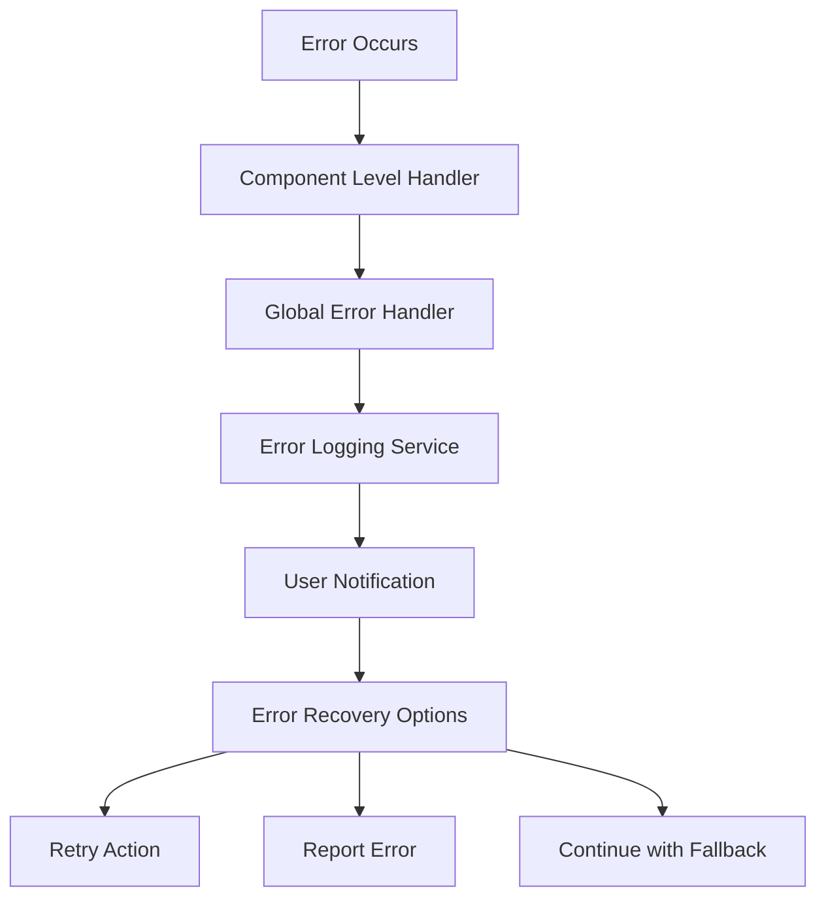
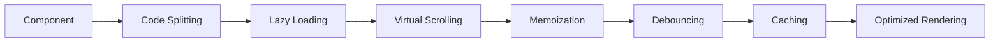
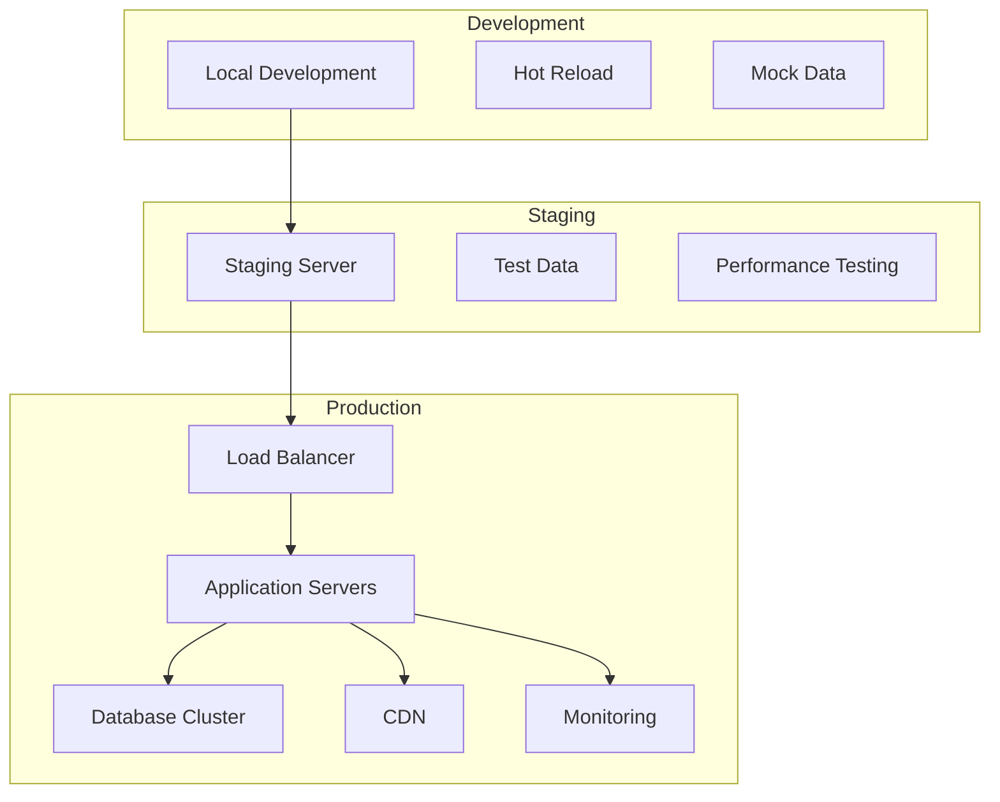
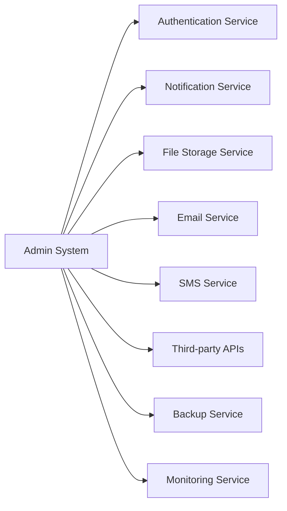

# Admin System Architecture Overview

## System Architecture Diagram

```mermaid
graph TB
    subgraph "Frontend Layer"
        A[Admin Layout] --> B[Admin Dashboard]
        A --> C[Employee Management]
        A --> D[Attendance Management]
        A --> E[Reports]
        A --> F[Schedules]
        A --> G[Settings]
        A --> H[Monitoring]
        A --> I[Audit Logs]
        A --> J[Backup & Restore]
        A --> K[Notifications]
        A --> L[API Admin]
        A --> M[Security]
    end

    subgraph "Shared Components"
        N[Data Table]
        O[Form Components]
        P[Modal Dialogs]
        Q[Export/Import]
        R[Search & Filters]
    end

    subgraph "API Layer"
        S[Employee API]
        T[Attendance API]
        U[Reports API]
        V[Schedules API]
        W[Settings API]
        X[Monitoring API]
        Y[Audit API]
        Z[Backup API]
        AA[Notification API]
        BB[Security API]
    end

    subgraph "Business Logic Layer"
        CC[User Management]
        DD[Attendance Processing]
        EE[Report Generation]
        FF[Schedule Engine]
        GG[System Configuration]
        HH[Health Monitoring]
        II[Audit Logging]
        JJ[Backup Service]
        KK[Notification Service]
        LL[Security Service]
    end

    subgraph "Data Layer"
        MM[(Users Database)]
        NN[(Attendance Database)]
        OO[(System Database)]
        PP[(Audit Logs)]
        QQ[(Backup Storage)]
        RR[(Cache)]
    end

    subgraph "External Services"
        SS[Email Service]
        TT[SMS Service]
        UU[File Storage]
        VV[Third-party APIs]
    end

    %% Connections
    C --> N
    C --> O
    C --> P
    D --> N
    D --> O
    D --> P
    E --> N
    E --> Q
    F --> N
    F --> O
    G --> O
    H --> N
    I --> N
    I --> Q
    J --> Q
    K --> O
    L --> O
    M --> O

    C --> S
    D --> T
    E --> U
    F --> V
    G --> W
    H --> X
    I --> Y
    J --> Z
    K --> AA
    L --> BB
    M --> BB

    S --> CC
    T --> DD
    U --> EE
    V --> FF
    W --> GG
    X --> HH
    Y --> II
    Z --> JJ
    AA --> KK
    BB --> LL

    CC --> MM
    DD --> NN
    EE --> NN
    FF --> NN
    GG --> OO
    HH --> OO
    II --> PP
    JJ --> QQ
    KK --> RR
    LL --> RR

    KK --> SS
    KK --> TT
    JJ --> UU
    BB --> VV
```

## Component Hierarchy

## Data Flow Architecture

## Security Architecture

## Component Dependencies

## State Management Flow

## Error Handling Architecture

## Performance Optimization Strategy

## Deployment Architecture

## Integration Points

This architecture provides a comprehensive overview of the admin system structure, showing how components interact, data flows through the system, and how different layers work together to provide a complete admin experience.